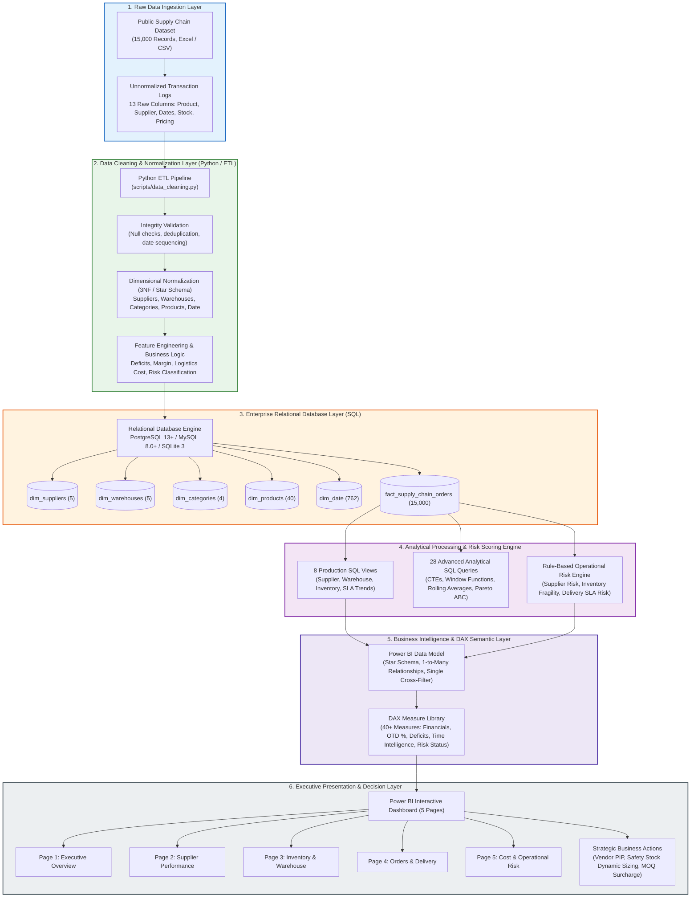

# System Architecture Diagram

The Supply Chain Intelligence & Operations Analytics Platform is built on a decoupled, production-grade 6-stage end-to-end analytics engineering pipeline.

---

## Architecture Component Description

1. **Raw Ingestion Layer**: Takes unnormalized operational logistics data comprising 15,000 historical order transactions spanning 2023–2024.
2. **Data Cleaning & ETL Layer**: Automated Python script (`scripts/data_cleaning.py`) executes data validation, cleans whitespace, parses dates, derives financial metrics, applies the logistics freight cost model, assigns operational risk tiers, and exports 3NF conformed CSV tables.
3. **Enterprise SQL Layer**: PostgreSQL 13+ and MySQL 8.0+ DDL scripts enforce primary keys, foreign key constraints, column validations, and B-tree indexes across fact and dimension tables.
4. **Analytical SQL Engine**: 8 reusable SQL views and 28 analytical queries execute complex window functions, running totals, rolling averages, conditional aggregations, and Pareto ABC classifications to answer core business questions.
5. **Power BI & DAX Modeling**: Star schema with single-direction 1:* relationships, coupled with a comprehensive DAX measure library in display folders.
6. **Executive Dashboard & Decision Layer**: 5-page interactive Power BI dashboard delivering cross-filtering, slicers, KPI alert cards, and drill-through paths to convert analytical findings into high-ROI business interventions.
