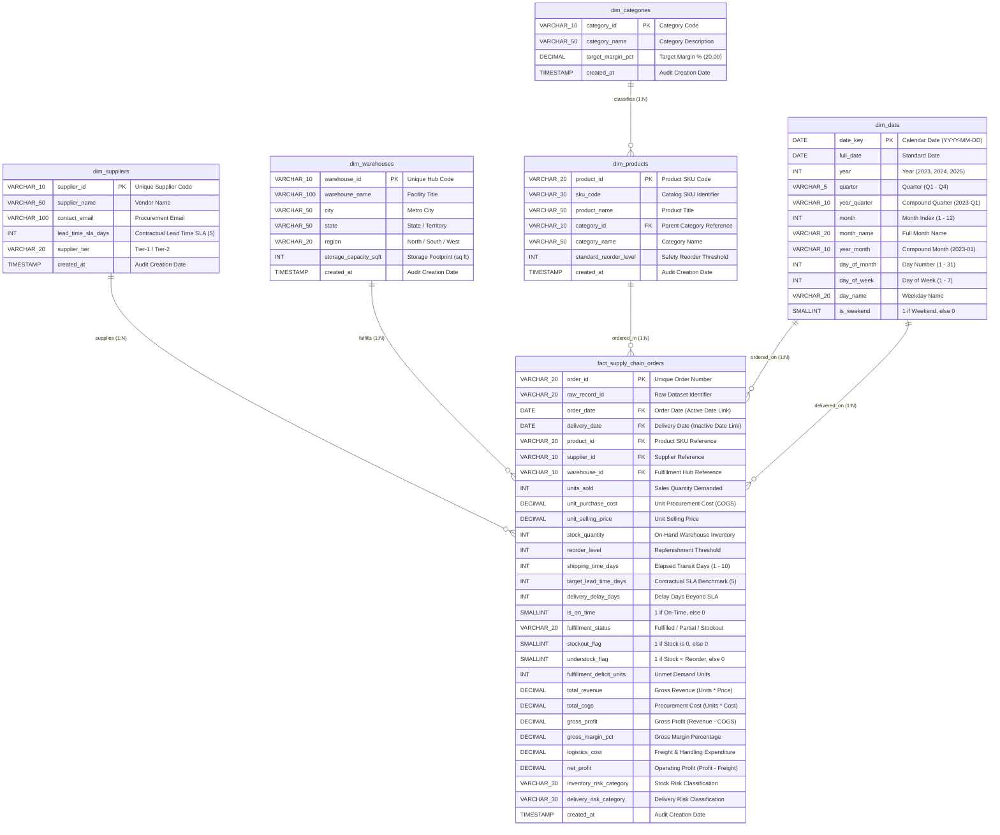

# Entity-Relationship (ER) Diagram

The diagram below represents the complete Entity-Relationship schema for the Supply Chain Intelligence platform. All tables are structured in a Star Schema / 3NF dimensional model with primary and foreign key constraints.

---

## Relationship & Integrity Rules
1. **Referential Integrity**: Every order record in `fact_supply_chain_orders` is strictly bound to valid records in `dim_suppliers`, `dim_warehouses`, `dim_products`, and `dim_date`.
2. **Cardinality**: All relationships between dimensions and the fact table are **1-to-Many ($1 : N$)**, preventing many-to-many ambiguity and circular filtering paths.
3. **Primary Key Constraints**: Enforce uniqueness of order IDs, product IDs, supplier IDs, warehouse IDs, category IDs, and date keys.
4. **Domain & Check Constraints**:
   - `units_sold >= 0`
   - `stock_quantity >= 0`
   - `shipping_time_days > 0`
   - `unit_purchase_cost > 0`
   - `unit_selling_price > 0`
   - `is_on_time IN (0, 1)`
   - `stockout_flag IN (0, 1)`
   - `understock_flag IN (0, 1)`
